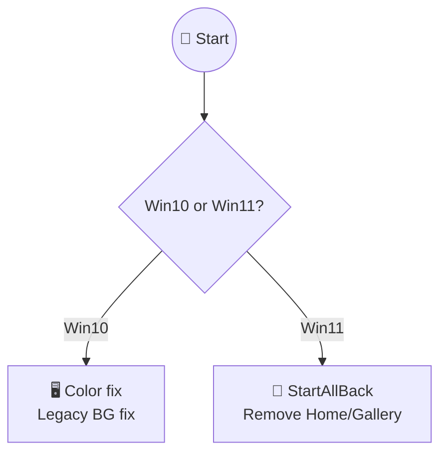

# do it for me

```markdown
<div align="center">

# Custom Windows Setup 🪟⚙️

**A repeatable post-install setup script for Windows 10/11 LTSC** with sane defaults, minimal surprises, and opinionated debloat.

[](https://aka.ms/powershell)
[](https://learn.microsoft.com/en-us/windows/iot/iot-enterprise/deployment/ltsc-release)
[](https://learn.microsoft.com/en-us/windows/iot/iot-enterprise/deployment/ltsc-release)
[](https://github.com/ItsMauridian/winsetup)
[](https://winget.run/)

</div>

---

## 🎯 Clean Windows LTSC in 1 command


*Optimized taskbar, animations off, privacy hardened, apps ready.*

---

## 🚀 Quick start

```powershell
# Elevated Administrator PowerShell
iwr https://winsetup.m05.dev -useb | iex
```

**Flow:**

```
1. MAS activation ✅
2. Store + winget bootstrap ✅  
3. Apps installed ✅
4. Tweaks & debloat ✅
5. Desktop log saved 📄
```


---

## 📊 Status

| Feature | Status | Notes |
| :-- | :-- | :-- |
| **Win11 IoT LTSC** | 🟢 Working | Latest test VM |
| **Animations** | 🟢 Fixed | Settings → Off |
| **AppX noise** | 🟡 Known | Design choice |
| **Win10 support** | 🟢 Stable | Branch-aware |


---

## 📦 Apps (~35 total)

```mermaid
graph LR
```

A[Essentials] --> B[Autoruns<br/>PowerShell<br/>PowerToys]

```
```

C[Gaming] --> D[EA Desktop<br/>Steam<br/>Ubisoft<br/>Epic]

```
```

E[Productivity] --> F[Discord<br/>Slack<br/>Telegram<br/>Obsidian]

```
```

G[Media] --> H[VLC<br/>iTunes<br/>Brave<br/>ShareX]

```
```

I[Dev/Tools] --> J[WinSCP<br/>PuTTY<br/>Sublime<br/>WingetUI]

```
K[Win11 Only] --> L[StartAllBack]

style A fill:#e1f5fe
style C fill:#f3e5f5
style E fill:#e8f5e8
style K fill:#fff3e0
```

**Gaming:** EA Desktop, Steam, Ubisoft Connect, Epic Launcher, Discord (stable+PTB)
**Media:** VLC, iTunes, Brave, ShareX, HWiNFO
**Productivity:** Obsidian, Telegram, Slack, PowerToys, Windows Terminal

*(Full list in log)*

---

## 🎨 Smart OS detection



Win10 --> Shared[⚙️ Animations Off<br/>Explorer→This PC<br/>OneDrive nuke]

```
Win11 --> Shared
Shared --> MAS[🔑 MAS activation]
Shared --> Winget[🛒 Store bootstrap]
Shared --> Apps[📦 App installs]
Shared --> Log((📄 Log))

style Start fill:#e3f2fd
style Log fill:#e8f5e8
```

**Always shared:** Privacy max, telemetry min, taskbar clean, passkeys preserved.

---

## ⚠️ Expected log noise

```
✅ Ignore:
❌ Missing files (already gone)
❌ VM GUID mismatches  
❌ AppX built-in errors
❌ Files temporarily locked

🛑 Real issues:
❌ MAS failed
❌ Winget bootstrap failed
❌ Animation didn't stick
```


---

## 🔄 vs Upstream WinSux

| Removed | Changed | Added |
| :-- | :-- | :-- |
| Black lockscreen | Taskbar: cleanup only | MAS first |
| YubiKey block | Edge: keep WebView2 | Store bootstrap |
| Forced alignment | Animations: SPI+reg | Desktop log |
| Hello-only login | Services: less aggressive | Brave debloat |


---

## 🛠️ GPU helpers included

| Script | Purpose |
| :-- | :-- |
| `Allow-PS-Scripts.cmd` | Enable execution policy |
| `DDU-Auto-GPU.ps1` | Automated driver wipe |
| `DDU-Manual-GPU.ps1` | Manual driver wipe |
| `Install-GPU.ps1` | Clean driver install |


---

## 🤝 Rules

1. **Minimal-diff** changes
2. No shell restarts unless required
3. Test Win10 + Win11 LTSC
4. Full files in PRs

---

<div align="center">

  
**Forked from** [](https://github.com/FR33THY/WinSux)  
**Inspired by** [](https://github.com/ChrisTitusTech/winutil)

</div>